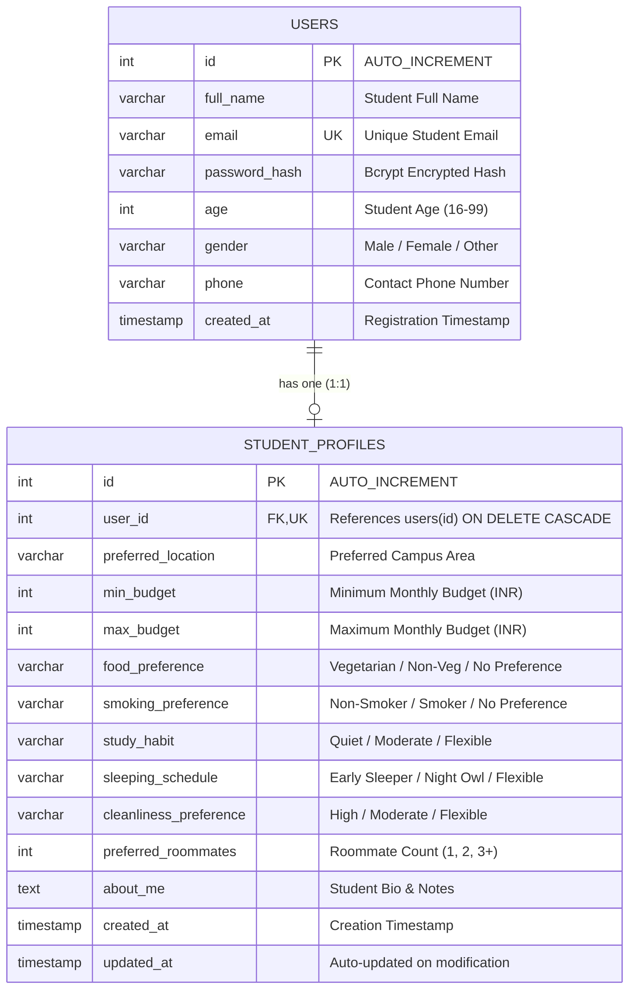

# Roommate Finder - Database Schema & Architecture

> **College 3rd Semester Project Presentation Document**  
> **Course:** Web Development / Database Management Systems (DBMS)  
> **Database Engine:** MySQL 8.0 (InnoDB Storage Engine)  
> **Character Set:** `utf8mb4` (Collation: `utf8mb4_unicode_ci`)

---

## 1. Entity-Relationship (ER) Diagram



---

## 2. Table Specifications

### Table 1: `users`
Stores student accounts, authentication credentials, and basic demographic data.

| Column Name | Data Type | Key / Constraint | Description |
|---|---|---|---|
| `id` | `INT` | **PRIMARY KEY**, Auto-Increment | Unique internal student ID |
| `full_name` | `VARCHAR(255)` | `NOT NULL` | Student full name (min 2 chars) |
| `email` | `VARCHAR(255)` | `NOT NULL`, **UNIQUE** | Registered college email address |
| `password_hash` | `VARCHAR(255)` | `NOT NULL` | One-way secure Bcrypt hash (10 salt rounds) |
| `age` | `INT` | `NOT NULL` | Age in years (validated 16–99) |
| `gender` | `VARCHAR(50)` | `NOT NULL` | Male, Female, Other, Prefer not to say |
| `phone` | `VARCHAR(20)` | `NOT NULL` | Contact telephone number |
| `created_at` | `TIMESTAMP` | `DEFAULT CURRENT_TIMESTAMP` | Account creation timestamp |

---

### Table 2: `student_profiles`
Stores housing preferences, living habits, budget boundaries, and roommate criteria.

| Column Name | Data Type | Key / Constraint | Description |
|---|---|---|---|
| `id` | `INT` | **PRIMARY KEY**, Auto-Increment | Unique profile entry ID |
| `user_id` | `INT` | **FOREIGN KEY**, **UNIQUE**, `NOT NULL` | References `users.id` with **`ON DELETE CASCADE`** |
| `preferred_location` | `VARCHAR(255)` | `NOT NULL` | Campus area (e.g. North Campus, South Campus) |
| `min_budget` | `INT` | `NOT NULL` | Minimum monthly rent budget in INR |
| `max_budget` | `INT` | `NOT NULL` | Maximum monthly rent budget in INR |
| `food_preference` | `VARCHAR(50)` | `NOT NULL` | Vegetarian, Non-Vegetarian, No Preference |
| `smoking_preference` | `VARCHAR(50)` | `NOT NULL` | Non-Smoker, Smoker, No Preference |
| `study_habit` | `VARCHAR(50)` | `NOT NULL` | Quiet, Moderate, Flexible |
| `sleeping_schedule` | `VARCHAR(50)` | `NOT NULL` | Early Sleeper, Night Owl, Flexible |
| `cleanliness_preference`| `VARCHAR(50)` | `NOT NULL` | High, Moderate, Flexible |
| `preferred_roommates` | `INT` | `DEFAULT 1`, `NOT NULL` | Number of flatmates requested (1, 2, 3+) |
| `about_me` | `TEXT` | `NULL` | Student lifestyle bio & notes |
| `created_at` | `TIMESTAMP` | `DEFAULT CURRENT_TIMESTAMP` | Initial record timestamp |
| `updated_at` | `TIMESTAMP` | `ON UPDATE CURRENT_TIMESTAMP` | Automatically refreshed on edits |

---

## 3. Key Relational Design Principles (For Viva / Presentation)

### 1. One-to-One Cardinality (1:1)
- Each student in `users` has at most one corresponding row in `student_profiles`.
- Enforced by placing a **`UNIQUE` constraint** on `student_profiles.user_id`.

### 2. Referential Integrity & Cascade Deletion
- Foreign Key constraint:
  ```sql
  CONSTRAINT fk_profile_user 
    FOREIGN KEY (user_id) REFERENCES users(id) 
    ON DELETE CASCADE
  ```
- If a student account is removed from `users`, their preference profile in `student_profiles` is automatically purged to eliminate orphaned records.

### 3. Data Privacy & Zero-Knowledge Credential Exposure
- Plaintext passwords are never stored. Only salted Bcrypt hashes (`password_hash`) are maintained in `users`.
- SQL queries for search (`/api/roommates`) explicitly use projections omitting `password_hash`:
  ```sql
  SELECT u.id, u.full_name, u.age, u.gender, u.email, u.phone, p.preferred_location, ...
  FROM users u JOIN student_profiles p ON u.id = p.user_id
  WHERE u.id != ?
  ```

### 4. SQL Injection Prevention
- All user inputs are handled via parameterized prepared statements (`?` placeholders) through the `mysql2` connection pool:
  ```javascript
  await pool.execute("SELECT id FROM users WHERE email = ? LIMIT 1", [email]);
  ```

---

## 4. Sample Queries for Demonstration

### Find all roommates in a campus zone with budget overlap
```sql
SELECT 
  u.full_name, 
  u.email, 
  p.preferred_location, 
  p.min_budget, 
  p.max_budget, 
  p.food_preference
FROM users u
JOIN student_profiles p ON u.id = p.user_id
WHERE p.preferred_location LIKE '%North Campus%'
  AND p.max_budget >= 5000 
  AND p.min_budget <= 8000
ORDER BY p.min_budget ASC;
```

### Fetch complete user dashboard details
```sql
SELECT 
  u.id, u.full_name, u.email, u.age, u.gender, u.phone,
  p.preferred_location, p.min_budget, p.max_budget,
  p.food_preference, p.study_habit, p.sleeping_schedule
FROM users u
LEFT JOIN student_profiles p ON u.id = p.user_id
WHERE u.id = 1;
```
